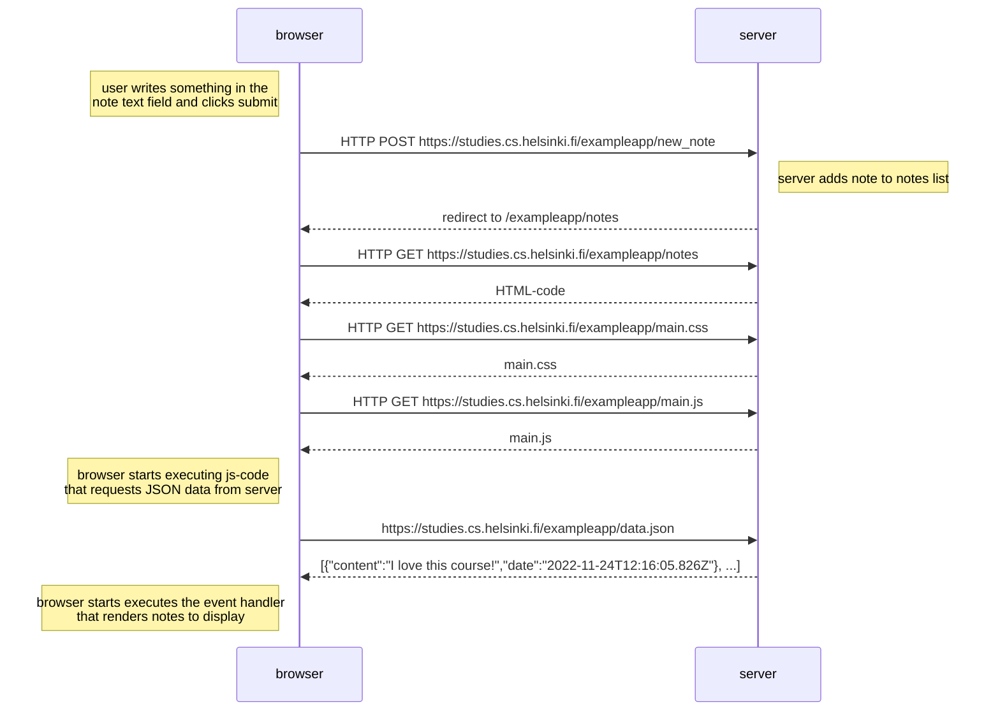

```mermaid
sequenceDiagram
    participant browser
    participant server

	Note left of browser: user writes something in the <br> note text field and clicks submit
    browser->>server: HTTP POST https://studies.cs.helsinki.fi/exampleapp/new_note
	Note right of server: server adds note to notes list
    server-->>browser: redirect to /exampleapp/notes

    browser->>server: HTTP GET https://studies.cs.helsinki.fi/exampleapp/notes
    server-->>browser: HTML-code

    browser->>server: HTTP GET https://studies.cs.helsinki.fi/exampleapp/main.css
    server-->>browser: main.css

    browser->>server: HTTP GET https://studies.cs.helsinki.fi/exampleapp/main.js
    server-->>browser: main.js
    Note left of browser: browser starts executing js-code <br> that requests JSON data from server

    browser->>server: https://studies.cs.helsinki.fi/exampleapp/data.json
    server-->>browser: [{"content":"I love this course!","date":"2022-11-24T12:16:05.826Z"}, ...]
    Note left of browser: browser starts executes the event handler<br>that renders notes to display
```