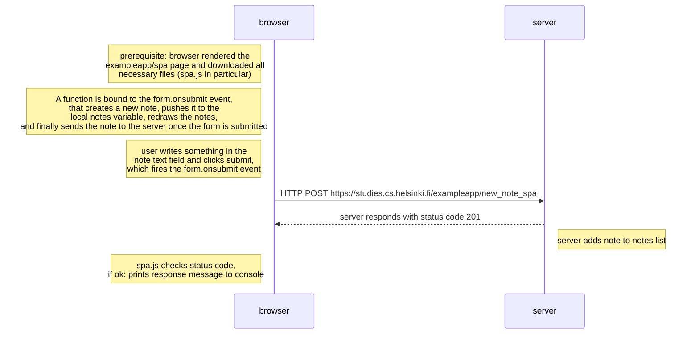

```mermaid
sequenceDiagram
    participant browser
    participant server

    Note left of browser: prerequisite: browser rendered the <br>exampleapp/spa page and downloaded all <br> necessary files (spa.js in particular)
	Note left of browser: A function is bound to the form.onsubmit event, <br> that creates  a new note, pushes it to the <br> local notes variable, redraws the notes, <br> and finally sends the note to the server once the form is submitted
    Note left of browser: user writes something in the <br> note text field and clicks submit, <br> which fires the form.onsubmit event
    browser->>server: HTTP POST https://studies.cs.helsinki.fi/exampleapp/new_note_spa
    server-->>browser: server responds with status code 201
	Note right of server: server adds note to notes list

    Note left of browser: spa.js checks status code, <br> if ok: prints response message to console
```
